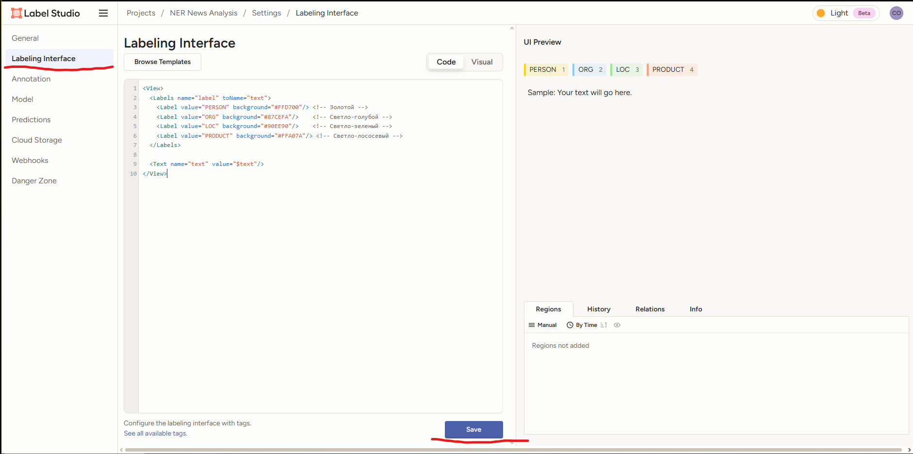
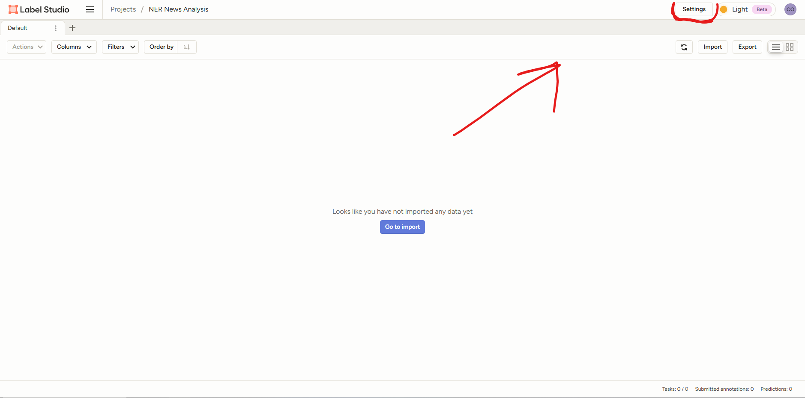
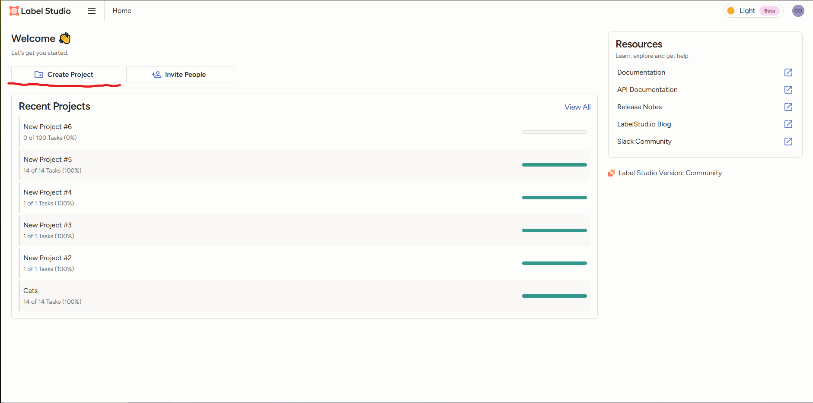
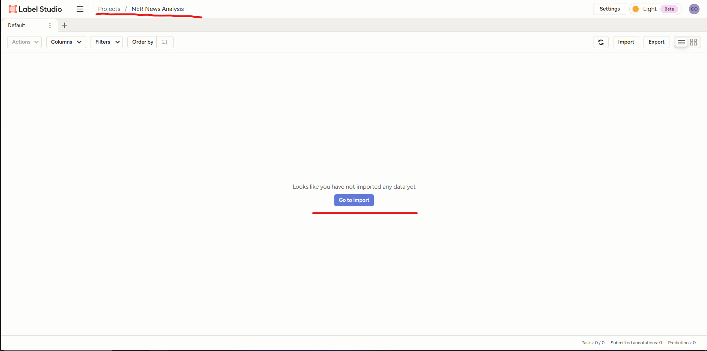
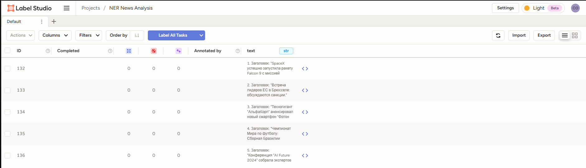
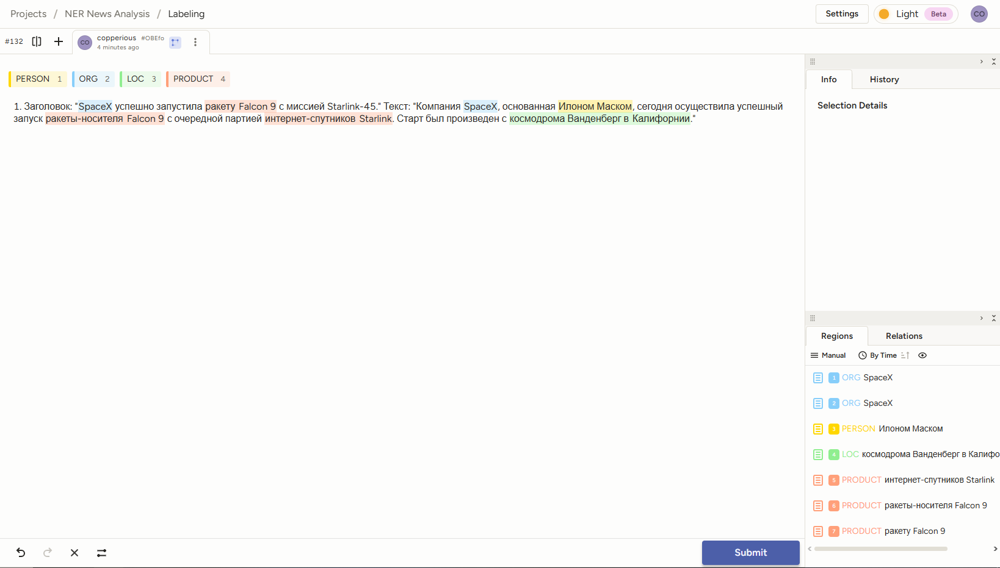
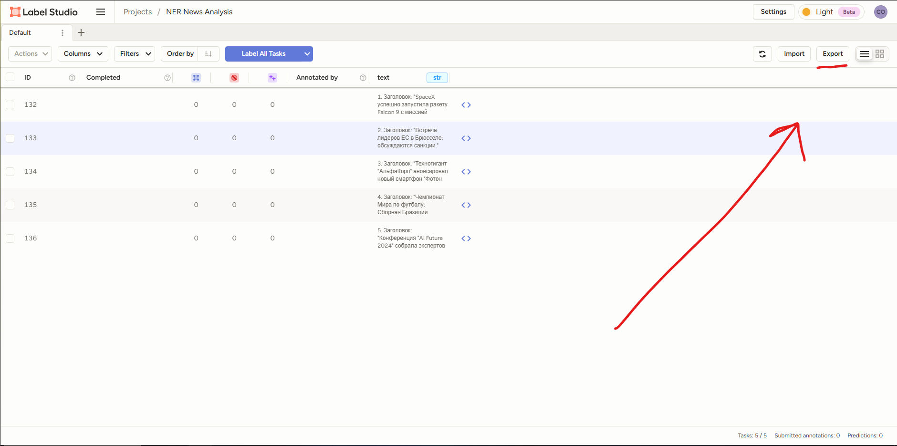
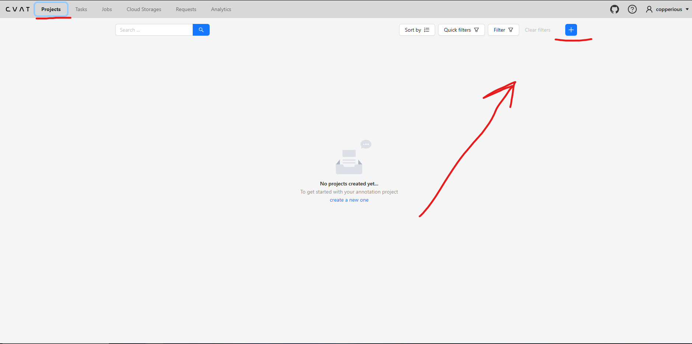
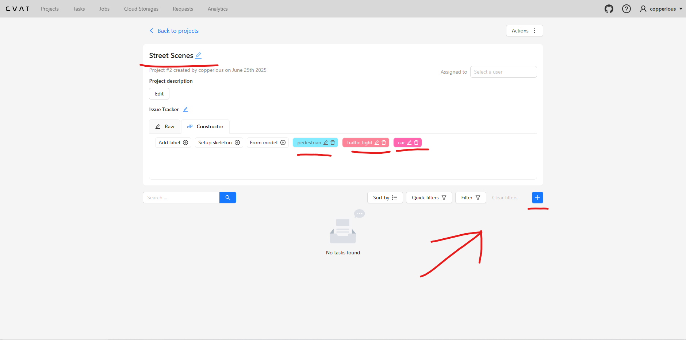
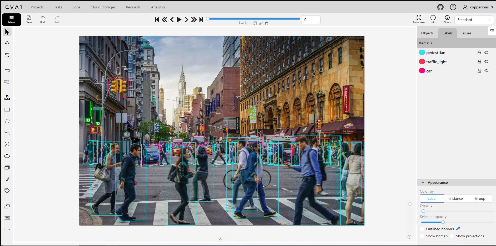

# Use Cases: Полный цикл разметки и обучения с Label Studio и CVAT

## Введение

Целью данного документа является демонстрация полных циклов работы с данными – от их сбора до обучения моделей машинного обучения – с использованием инструментов разметки Label Studio и CVAT. Эти сценарии (Use Cases) призваны наглядно показать практическое применение каждого инструмента в контексте MLOps-пайплайна и помочь в понимании всего процесса.

## Use Case 1: Извлечение именованных сущностей (NER) с помощью Label Studio

### 1. Сбор и подготовка данных

*   **Описание типа данных:**
    Для данного Use Case мы будем использовать короткие текстовые фрагменты, представляющие собой новостные заголовки и краткие аннотации к новостям. Примерная длина каждого текстового фрагмента – от 1 до 3 предложений. Такой формат удобен для демонстрации процесса разметки NER, так как задачи (тексты) достаточно компактны.

*   **Источники:**
    Данные могут быть получены из различных источников:
    *   Публичные RSS-ленты новостных агентств (например, РИА Новости, Интерфакс).
    *   Парсинг заголовков с новостных веб-сайтов.
    *   Внутренние архивы новостных дайджестов компании.
    Гипотетически, мы могли бы использовать API новостного агрегатора или подготовить выгрузку из базы данных. Для нашего примера, предположим, что данные собраны в простой текстовый файл или CSV, где каждая строка – отдельная новость.

*   **Начальная подготовка:**
    Перед загрузкой в Label Studio может потребоваться минимальная подготовка:
    1.  **Очистка от HTML-тегов:** Если данные получены путем парсинга веб-страниц, необходимо удалить все HTML-теги, оставив только чистый текст.
    2.  **Удаление избыточных пробелов и спецсимволов:** Нормализация пробелов (удаление двойных пробелов, пробелов в начале/конце строки) и удаление нерелевантных спецсимволов (если они не являются частью сущностей).
    3.  **Разбиение на документы/задачи:** Убедиться, что каждый текстовый фрагмент, который будет представлять собой одну задачу для разметки, четко отделен (например, находится на новой строке в файле). Для длинных статей может потребоваться разбивка на абзацы или смысловые блоки. В нашем случае, так как мы работаем с короткими новостями, каждая новость уже является отдельной задачей.

*   **[Текст](data/news_data.txt)**


### 2. Настройка проекта в Label Studio

На этом этапе мы создадим проект в Label Studio, настроим интерфейс для разметки NER и импортируем наши подготовленные текстовые данные.

*   **Создание нового проекта:**
    1.  Войдите в Label Studio.
    2.  Нажмите кнопку "Create Project" (Создать проект).
        
    3.  Введите имя проекта, например, "NER News Analysis". Можно также добавить описание.
    4.  Нажмите "Save" (Сохранить) или "Create" (Создать).

*   **Конфигурация разметки (Labeling Config) для NER:**
    1.  После создания проекта перейдите на вкладку "Settings" (Настройки), а затем в подраздел "Labeling Interface" (Интерфейс разметки).
        
    2.  Здесь необходимо определить XML-конфигурацию для задачи NER. Можно выбрать один из готовых шаблонов ("Named Entity Recognition") и адаптировать его, или написать конфигурацию с нуля.
    3.  Для наших сущностей (`PERSON`, `ORG`, `LOC`, `PRODUCT`) конфигурация может выглядеть так:

        ```xml
        <View>
          <Labels name="label" toName="text">
            <Label value="PERSON" background="#FFD700"/> <!-- Золотой -->
            <Label value="ORG" background="#87CEFA"/>    <!-- Светло-голубой -->
            <Label value="LOC" background="#90EE90"/>    <!-- Светло-зеленый -->
            <Label value="PRODUCT" background="#FFA07A"/> <!-- Светло-лососевый -->
          </Labels>
        
          <Text name="text" value="$text"/> 
        </View>
        ```

        *   **Пояснение:**
            *   `<View>`: Корневой тег.
            *   `<Labels>`: Определяет набор меток (сущностей). `toName="text"` указывает, что эти метки применяются к элементу с `name="text"`.
            *   `<Label>`: Определяет каждую конкретную метку с ее значением (`value`) и цветом фона (`background`) для визуального выделения.
            *   `<Text>`: Определяет, как будут отображаться текстовые данные. `name="text"` — это идентификатор этого блока данных. `value="$text"` указывает, что данные для этого блока будут браться из поля `text` входных данных. **Если вы импортируете простой `.txt` файл (где каждая строка - задача), то можно использовать `value="$text"`. Если вы импортируете CSV файл, где текстовые данные находятся в столбце с именем, например, "text_data", то нужно будет написать `value="$text_data"`**.

    4.  Вставьте этот XML-код в поле "Labeling Config".
        
    5.  Нажмите "Save" (Сохранить).

*   **Импорт данных:**
    1.  Перейдите на главную страницу проекта (обычно кликнув на его имя) или найдите кнопку "Import" (Импорт) или "Add Data" (Добавить данные).
        
    2.  Выберите способ импорта. Для наших текстовых данных, если они сохранены в файле `news_data.txt` (каждая новость на новой строке) или `news_data.csv` (с одним столбцом `text`), выберите "Upload Files" (Загрузить файлы).
    3.  Загрузите ваш файл (`news_data.txt` или `news_data.csv`).
    4.  После загрузки Label Studio обработает файл и отобразит количество импортированных задач.
        


### 3. Процесс разметки

После импорта данных можно приступать непосредственно к разметке.

*   **Описание интерфейса разметки для NER:**
    1.  На странице проекта нажмите кнопку "Label All Tasks" (Начать разметку) или выберите первую неразмеченную задачу из списка.
    2.  Откроется интерфейс разметки. В основной части экрана будет отображаться текст текущей задачи (нашей новости). Сбоку (обычно справа или внизу, в зависимости от конфигурации) будет панель с метками (Labels), которые мы определили в XML (`PERSON`, `ORG`, `LOC`, `PRODUCT`), каждая со своим цветом.

*   **Ключевые действия разметчика:**
    1.  **Чтение текста:** Внимательно прочитать текст задачи.
    2.  **Выделение сущности:** С помощью мыши выделить фрагмент текста, который соответствует одной из определенных сущностей. Например, в тексте "SpaceX, основанная Илоном Маском..." выделить "SpaceX".
    3.  **Выбор метки:** После выделения текста кликнуть на соответствующую метку на панели меток. Например, для "SpaceX" кликнуть на метку `ORG`. Выделенный текст окрасится в цвет, присвоенный этой метке (светло-голубой).
    4.  **Продолжение разметки:** Повторить шаги 2-3 для всех сущностей в текущем тексте. Например, выделить "Илоном Маском" и присвоить метку `PERSON`, "Falcon 9" и "Starlink" – `PRODUCT`, "Ванденберг" и "Калифорнии" – `LOC`.
    5.  **Завершение задачи:** После разметки всех сущностей в текущей задаче нажать кнопку "Submit" (Отправить) или "Update" (Обновить), чтобы сохранить аннотации и перейти к следующей задаче. Если задача по какой-то причине не может быть размечена.
    

### 4. Экспорт размеченных данных

После того как все (или необходимая часть) данных размечены, аннотации нужно экспортировать для дальнейшего использования в обучении модели.

*   **Выбор формата экспорта:**
    1.  На главной странице проекта Label Studio найти и нажать кнопку "Export" (Экспорт).
        
    2.  Откроется окно или страница выбора формата экспорта. Label Studio предлагает несколько форматов. Для задач NER наиболее релевантными и часто используемыми являются:
        *   **JSON:** Это нативный формат Label Studio, который содержит всю информацию об аннотациях, включая смещения символов (start, end) для каждой сущности, что очень удобно для большинства NLP-фреймворков. Существует несколько вариантов JSON (полный, минимальный).
        *   **CONLL2003:** Стандартный формат для задач NER, где каждое слово (токен) и его метка находятся на отдельной строке. Этот формат часто используется в академических исследованиях и некоторыми библиотеками.
        *   **CSV/TSV:** Может быть полезен, если требуется простой табличный вид, но для NER он менее информативен, чем JSON или CONLL.
    3.  Для нашего Use Case, **JSON** является предпочтительным выбором, так как он легко парсится и содержит точную информацию о позициях сущностей. Выберем его.
    4.  Нажмите кнопку "Export" (Экспорт) для выбранного формата. Файл с аннотациями будет загружен на ваш компьютер ([Например](data/project-14-at-2025-06-25-13-18-72190ffe.json)).

*   **Описание структуры экспортируемого файла (для JSON):**
    Экспортированный JSON-файл будет содержать массив объектов, где каждый объект представляет одну размеченную задачу (новость). Примерная структура для одной задачи может выглядеть так:

    ```json
    [
      {
         "id": 132, // Уникальный идентификатор задачи в Label Studio
         "annotations": [ // Массив аннотаций для этой задачи (обычно одна, если нет review)
            {
            "id": 32, // ID аннотации
            "completed_by": 1, // ID пользователя, выполнившего разметку
            "result": [ // Массив фактических разметок (сущностей)
               {
                  "value": {
                  "start": 15,     // Начальный индекс символа сущности в тексте
                  "end": 21,       // Конечный индекс символа сущности (не включая)
                  "text": "SpaceX", // Текст выделенной сущности
                  "labels": [      // Список меток (обычно одна для NER)
                     "ORG"
                  ]
                  },
                  "id": "efpefyI5IN", // Уникальный ID этой конкретной метки
                  "from_name": "label", // Имя тега <Labels> из XML-конфигурации
                  "to_name": "text",   // Имя тега <Text> из XML-конфигурации
                  "type": "labels",
                  "origin": "manual" // Указывает, что разметка сделана вручную
               },
               // ... другие размеченные сущности для этой задачи ...
               {
                  "value": {
                  "start": 40,
                  "end": 55,
                  "text": "ракету Falcon 9",
                  "labels": [
                     "PRODUCT"
                  ]
                  },
                  "id": "h74F5AQxzw",
                  "from_name": "label",
                  "to_name": "text",
                  "type": "labels",
                  "origin": "manual"
               }
            ],
            // ... другая метаинформация об аннотации (was_cancelled, created_at, lead_time и т.д.) ...
            "task": 132 // Ссылка на ID задачи
            }
         ],
         "file_upload": "41c406e4-news_data.txt", // Имя исходного файла (если применимо)
         "data": {
            // Поле, содержащее исходные данные для разметки.
            // Имя этого поля (здесь "text") соответствует тому, что было указано 
            // в XML-конфигурации в атрибуте value тега <Text> (например, $text).
            "text": "1. Заголовок: \"SpaceX успешно запустила ракету Falcon 9 с миссией Starlink-45.\" Текст: \"Компания SpaceX, основанная Илоном Маском, сегодня осуществила успешный запуск ракеты-носителя Falcon 9 с очередной партией интернет-спутников Starlink. Старт был произведен с космодрома Ванденберг в Калифорнии.\""
         },
         "meta": {}, // Дополнительные метаданные
         // ... другая метаинформация о задаче (created_at, updated_at, project и т.д.) ...
         "project": 14 // ID проекта
      }
    ]
    ```


### 5. Обучение модели

После экспорта аннотаций из Label Studio, следующим шагом является обучение модели машинного обучения для извлечения именованных сущностей. Рассмотрим этот процесс на примере использования библиотеки **spaCy**.

*   **Тип модели и фреймворк:**
    *   **spaCy** – это популярная open-source библиотека для продвинутой обработки естественного языка (NLP) на Python. Она предоставляет эффективные инструменты для обучения кастомных моделей, включая модели для извлечения именованных сущностей (NER). spaCy хорошо работает с аннотациями, указывающими начальные и конечные смещения символов сущностей, что соответствует формату экспорта Label Studio.

*   **Процесс подготовки данных и обучения модели с spaCy:**

    1.  **Загрузка и парсинг аннотаций Label Studio:**
        *   Первым делом необходимо загрузить JSON-файл, экспортированный из Label Studio, и извлечь из него тексты и соответствующие им аннотации (позиции и метки сущностей).
        *   **Действие:** Написать Python-скрипт для чтения JSON-файла.
        *   **Данные из JSON:** Для каждой задачи (текста) нам нужны:
            *   Сам текст: `task['data']['text']` (или другое имя поля, если оно было изменено в конфигурации Label Studio).
            *   Список сущностей: Из `task['annotations'][0]['result']`, где каждый элемент содержит `value['start']`, `value['end']`, `value['text']`, и `value['labels'][0]`.

            ```python
            import json

            def load_label_studio_data(json_filepath):
                with open(json_filepath, 'r', encoding='utf-8') as f:
                    data = json.load(f)
                return data
            
            # label_studio_output = load_label_studio_data("path/to/your/export.json")
            ```

    2.  **Преобразование данных в формат spaCy:**
        *   spaCy для обучения NER-моделей ожидает данные в специфическом формате: список кортежей, где каждый кортеж состоит из текста и словаря с ключом `"entities"`. Значением этого ключа является список кортежей, каждый из которых описывает одну сущность: `(start_char_offset, end_char_offset, LABEL_STRING)`.
        *   **Действие:** Написать функцию для преобразования загруженных данных.

            ```python
            def convert_to_spacy_format(label_studio_data):
                spacy_training_data = []
                for task in label_studio_data:
                    text_content = ""
                    # Пытаемся получить текст. Ключ может отличаться.
                    if 'text' in task['data']:
                        text_content = task['data']['text']
                    elif task['data']: # Если 'text' нет, берем первый строковый ключ
                        for key_data in task['data']:
                            if isinstance(task['data'][key_data], str):
                                text_content = task['data'][key_data]
                                break
                    if not text_content:
                        print(f"Предупреждение: Текст не найден для задачи ID {task.get('id')}")
                        continue

                    entities = []
                    if task.get('annotations'):
                        for annotation_bundle in task['annotations']: # Обычно один бандл аннотаций
                            for annotation_result in annotation_bundle.get('result', []):
                                if annotation_result.get('type') == 'labels' and 'value' in annotation_result:
                                    value = annotation_result['value']
                                    if 'start' in value and 'end' in value and 'labels' in value and value['labels']:
                                        start_offset = value['start']
                                        end_offset = value['end']
                                        label = value['labels'][0] 
                                        entities.append((start_offset, end_offset, label))
                    
                    # Добавляем данные, даже если нет сущностей (важно для обучения NER)
                    spacy_training_data.append((text_content, {"entities": entities}))
                return spacy_training_data

            # Пример использования:
            # raw_data_from_ls = load_label_studio_data("path/to/your/export.json")
            # TRAIN_DATA = convert_to_spacy_format(raw_data_from_ls)
            
            # Пример одной записи в TRAIN_DATA:
            # ("Компания SpaceX, основанная Илоном Маском...", 
            #  {"entities": [(15, 21, "ORG"), (49, 60, "PERSON"), ...]})
            ```

    3.  **Создание и настройка NER-модели в spaCy:**
        *   **Действие:** Инициализировать модель spaCy (пустую или предобученную) и настроить компонент NER.
            *   Можно начать с пустой языковой модели (например, `spacy.blank("ru")` для русского языка) и добавить к ней NER-компонент.
            *   Либо загрузить предобученную модель (например, `ru_core_news_sm`) и дообучить её NER-компонент. Дообучение обычно дает лучшие результаты, если доступно достаточно данных.

            ```python
            import spacy
            import random
            from spacy.training.example import Example
            from spacy.util import minibatch, compounding

            # Используем TRAIN_DATA из предыдущего шага
            # TRAIN_DATA = [...] 

            def train_spacy_ner_model(training_data, model_name=None, new_model_name="custom_ner_model", output_dir=None, n_iter=20):
                """Обучает кастомную NER модель с spaCy."""
                if model_name is not None:
                    nlp = spacy.load(model_name)  # Загрузка существующей модели
                    print(f"Загружена модель '{model_name}'")
                else:
                    nlp = spacy.blank("ru")  # Создание пустой модели для русского языка
                    print("Создана пустая модель 'ru'")

                # Добавление NER компонента в пайплайн, если его нет
                if "ner" not in nlp.pipe_names:
                    ner = nlp.add_pipe("ner", last=True)
                else:
                    ner = nlp.get_pipe("ner")

                # Добавление новых меток сущностей в модель
                for _, annotations in training_data:
                    for ent in annotations.get("entities"):
                        ner.add_label(ent[2]) # ent[2] это метка (PERSON, ORG и т.д.)
                
                # Отключение других компонентов пайплайна для обучения только NER
                pipe_exceptions = ["ner", "trf_wordpiecer", "trf_tok2vec"]
                unaffected_pipes = [pipe for pipe in nlp.pipe_names if pipe not in pipe_exceptions]

                with nlp.disable_pipes(*unaffected_pipes):
                    optimizer = nlp.begin_training()
                    for iteration in range(n_iter):
                        random.shuffle(training_data)
                        losses = {}
                        batches = minibatch(training_data, size=compounding(4.0, 32.0, 1.001))
                        for batch in batches:
                            examples = []
                            for text, annotations in batch:
                                doc = nlp.make_doc(text)
                                examples.append(Example.from_dict(doc, annotations))
                            nlp.update(examples, drop=0.35, sgd=optimizer, losses=losses)
                        print(f"Итерация {iteration + 1}/{n_iter}, Потери: {losses}")
                
                # Сохранение обученной модели
                if output_dir is not None:
                    nlp.to_disk(output_dir)
                    print(f"Обученная модель сохранена в {output_dir}")
                return nlp

            # Пример запуска обучения:
            # nlp_model = train_spacy_ner_model(TRAIN_DATA, output_dir="my_ner_model_v1", n_iter=30)
            ```

*   **Ссылки на релевантные ресурсы:**
    *   Документация spaCy по обучению NER: [https://spacy.io/usage/training#ner](https://spacy.io/usage/training#ner)
    *   Пример обучения NER от Label Studio: [https://labelstud.io/blog/tutorial-build-nlu-model-with-label-studio-and-rasa/](https://labelstud.io/blog/tutorial-build-nlu-model-with-label-studio-and-rasa/)


### 6. Итеративный процесс (Active Learning / Предразметка)

После обучения первой версии NER-модели (как описано в этапе 5), её можно использовать для ускорения и улучшения процесса разметки последующих данных. Этот итеративный подход, часто называемый "активным обучением" (Active Learning) или просто использованием модели для предразметки, является важной частью эффективного MLOps-пайплайна.

*   **Использование обученной модели для предразметки в Label Studio:**
    Label Studio позволяет подключать обученные модели в качестве **ML-бэкендов (ML Backends)**. Такой бэкенд может автоматически предлагать аннотации для новых, неразмеченных данных.

    1.  **Создание ML-бэкенда:**
        *   Необходимо обернуть вашу обученную spaCy NER-модель (или любую другую) в простой веб-сервис (например, с использованием Flask или FastAPI), который будет принимать текст на вход и возвращать предсказанные сущности в формате, понятном Label Studio.
        *   Label Studio предоставляет [репозиторий с примерами ML-бэкендов](https://github.com/HumanSignal/label-studio-ml-backend), включая примеры для spaCy.
        *   **Примерная логика ML-бэкенда для spaCy NER:**
            ```python
            # Фрагмент кода для ML-бэкенда (упрощенно)
            from label_studio_ml.model import LabelStudioMLBase
            from label_studio_ml.utils import get_label_config
            import spacy

            class SpacyNerPredictor(LabelStudioMLBase):
                def __init__(self, **kwargs):
                    super(SpacyNerPredictor, self).__init__(**kwargs)
                    # Загрузка вашей обученной модели
                    self.nlp_model = spacy.load("/path/to/your/my_ner_model_v1") 
                    # Получение информации о метках из конфигурации проекта Label Studio
                    self.labels = get_label_config(self.project_path).get('label_from_name') 
                                                                    # label_from_name - имя тега <Labels>

                def predict(self, tasks, **kwargs):
                    predictions = []
                    for task in tasks:
                        text_to_predict = task['data'].get('text') # или другой ключ
                        if not text_to_predict: continue

                        doc = self.nlp_model(text_to_predict)
                        results = []
                        for ent in doc.ents:
                            if ent.label_ in self.labels: # Предсказываем только те метки, что есть в проекте
                                results.append({
                                    "from_name": "label", # Должно соответствовать <Labels name="label" ...>
                                    "to_name": "text",    # Должно соответствовать <Text name="text" ...>
                                    "type": "labels",
                                    "value": {
                                        "start": ent.start_char,
                                        "end": ent.end_char,
                                        "text": ent.text,
                                        "labels": [ent.label_]
                                    }
                                })
                        predictions.append({"result": results})
                    return predictions
            ```

    2.  **Запуск ML-бэкенда:**
        *   Этот сервис (ML-бэкенд) запускается как отдельный процесс, доступный по сети для Label Studio. Его можно запустить локально или развернуть в Docker-контейнере.
        *   `label-studio-ml start /path/to/your/ml_backend_script_directory`

    3.  **Подключение ML-бэкенда к проекту Label Studio:**
        *   В настройках проекта Label Studio (Settings -> Machine Learning) добавить URL вашего запущенного ML-бэкенда.
        *   Label Studio начнет автоматически отправлять задачи на этот бэкенд для получения предсказаний.

*   **Процесс разметки с предсказаниями:**
    1.  Когда разметчик открывает новую задачу, Label Studio сначала запросит предсказания у ML-бэкенда.
    2.  Предсказанные сущности будут автоматически отображены на тексте (например, подсвечены соответствующими цветами).
    3.  **Задача разметчика:**
        *   **Проверить** корректность предсказаний.
        *   **Исправить** ошибки (удалить неверные сущности, добавить пропущенные, изменить границы или метки).
        *   **Доразметить** то, что модель не смогла определить.
    4.  Этот процесс обычно значительно **быстрее**, чем разметка с нуля, особенно если модель уже имеет приемлемое качество.

*   **Цикл улучшения модели:**
    1.  Размеченные (и исправленные) данные с использованием предсказаний снова экспортируются.
    2.  Эти новые данные добавляются к исходному обучающему набору.
    3.  Модель переобучается на расширенном и более качественном наборе данных.
    4.  Обновленная модель развертывается в ML-бэкенде.
    5.  Цикл повторяется.

    Этот итеративный подход позволяет постоянно улучшать качество модели и сокращать затраты на ручную разметку.


## Use Case 2: Детекция объектов на изображениях с помощью CVAT

### 1. Сбор и подготовка данных

*   **Описание типа данных:**
    Для данного Use Case мы будем использовать **цветные изображения**, содержащие различные объекты на уличных сценах. Это могут быть фотографии, сделанные с автомобильных регистраторов, камер наружного наблюдения или просто фотографии городских улиц. Разрешение изображений может варьироваться, но для примера возьмем изображения среднего разрешения (например, от 640x480 до 1920x1080 пикселей).

*   **Источники:**
    Данные могут быть получены из различных источников:
    *   **Публичные датасеты для детекции объектов:** Например, COCO (Common Objects in Context), Pascal VOC, Open Images Dataset, Cityscapes.
    *   **Собственные фото- или видеоматериалы:** Записи с камер, фотографии, сделанные для конкретного проекта.
    *   **Веб-скрейпинг:** Сбор изображений с общедоступных фотохостингов или поисковых систем.

*   **Начальная подготовка:**
    Перед загрузкой в CVAT для изображений может потребоваться следующая подготовка:
    1.  **Проверка форматов:** Убедиться, что все изображения сохранены в распространенных форматах, таких как JPEG (.jpg, .jpeg) или PNG (.png). CVAT поддерживает множество форматов, но эти наиболее стандартны.
    2.  **Отбор релевантных изображений:** Удалить некачественные изображения (слишком размытые, темные, без целевых объектов).
    3.  **Анонимизация (если необходимо):** Если на изображениях присутствуют чувствительные данные (например, лица людей, не являющихся объектами интереса, или номерные знаки автомобилей), и это требуется политикой проекта, может потребоваться их предварительное размытие или закрашивание. CVAT также имеет инструменты для этого, но иногда это делается до загрузки.
    4.  **Структурирование данных:** Собрать все изображения в одну папку на локальном компьютере для удобства загрузки.
    5.  **Разбиение видео на кадры (если источник - видео):** Если исходные данные - это видеофайл, а нужна покадровая разметка изображений, то видео необходимо предварительно разбить на отдельные кадры (например, с помощью FFmpeg). CVAT также умеет работать с видео напрямую, но если цель — именно разметка отдельных изображений, то их предварительное извлечение может быть шагом подготовки. В нашем Use Case мы предполагаем, что у нас уже есть набор отдельных изображений.

### 2. Настройка проекта/задачи в CVAT

На этом этапе мы создадим проект и задачу в CVAT, определим метки для наших объектов и загрузим подготовленные изображения.

*   **Создание нового проекта:**
    1.  Войдите в CVAT.
    2.  Перейдите в раздел "Projects" (Проекты) в боковом меню.
    3.  Нажмите кнопку "+ Create new project" (Создать новый проект).
        
    4.  Введите имя проекта, например, "Urban Object Detection". Можно добавить описание.
    5.  Нажмите "Submit" (Отправить).

*   **Создание новой задачи (Task):**
    1.  Находясь внутри созданного проекта (или просто в разделе "Tasks", если проект не создавался), нажмите кнопку "+ Create new task" (Создать новую задачу) или иконку плюса.
        
    2.  **Заполните информацию о задаче:**
        *   **Name (Имя):** Например, "Street Scenes Batch 1".
        *   **Project (Проект):** Выберите созданный ранее проект "Urban Object Detection" (если создавали).
        *   **Labels (Метки):** Это самый важный шаг здесь.
            *   Нажмите "Add label" (Добавить метку).
            *   В поле "Label name" (Имя метки) введите `car`.
            *   Выберите цвет для метки (опционально).
            *   Нажмите "Continue" (Продолжить) или "+".
            *   Повторите для меток `pedestrian` и `traffic_light`, выбрав для них разные цвета для наглядности.
            *   После добавления всех меток нажмите "Done" (Готово) в конструкторе меток.

*   **Импорт данных (загрузка изображений):**
    1.  В форме создания задачи найдите раздел "Select files" (Выбрать файлы).
    2.  Перетащите папку с вашими изображениями в область "My computer" (Мой компьютер) или нажмите на нее и выберите файлы через диалоговое окно.
    3.  **Advanced configuration (Расширенные настройки) - опционально:**
        *   Здесь можно настроить такие параметры, как `Image quality` (Качество изображений при отображении), `Use cache` (Использовать кэш), `Frame step` (Шаг кадра - для видео), `Chunk size` (Размер блока данных для загрузки). Для нашего случая с небольшим количеством изображений стандартные настройки подойдут.
        *   `Overlap size` и `Segment size` важны для разделения больших задач на задания (jobs), но для нашего небольшого набора данных это пока не критично.
    4.  После добавления меток и выбора файлов нажмите "Submit & Open" (Отправить и Открыть) или "Submit & Continue" (Отправить и Продолжить). CVAT начнет создавать задачу и загружать изображения.
    5.  После создания задачи вы либо автоматически перейдете к интерфейсу разметки (если нажали "Submit & Open"), либо увидите задачу в списке.

### 3. Процесс разметки

После создания задачи и загрузки изображений, можно начинать разметку объектов с помощью ограничивающих рамок (Bounding Boxes).

*   **Описание интерфейса разметки для детекции объектов:**
    1.  Откройте задачу для разметки. Вы увидите первое изображение из загруженного набора.
    2.  **Основные элементы интерфейса:**
        *   **Центральная область:** Отображение текущего изображения.
        *   **Левая панель инструментов:** Содержит инструменты для рисования фигур (Rectangle, Polygon, Polyline, Cuboid, Points, Ellipse), инструменты для редактирования (Merge, Group, Split), а также навигационные инструменты (Zoom, Fit image, Pan).
        *   **Правая панель:** Вкладка "Objects" (Объекты) отображает список уже размеченных объектов на текущем кадре. Вкладка "Labels" (Метки) показывает доступные метки (`car`, `pedestrian`, `traffic_light`), которые мы определили.
        *   **Верхняя панель (Player):** Навигация по кадрам (для видео или последовательностей изображений), кнопки сохранения, меню и т.д.

*   **Ключевые действия разметчика (рисование Bounding Boxes):**
    1.  **Выбор инструмента:** На левой панели инструментов выберите "Draw new rectangle" (Нарисовать новый прямоугольник) или нажмите горячую клавишу `N`, затем `R` (или просто `R`, если прямоугольник уже выбран по умолчанию для новых фигур).
    2.  **Выбор метки:** На правой панели "Labels" выберите метку для объекта, который собираетесь размечать, например, `car`.
    3.  **Рисование Bounding Box:** На изображении кликните и потяните мышь, чтобы нарисовать прямоугольник вокруг первого автомобиля. Старайтесь, чтобы рамка как можно точнее охватывала объект.
    4.  **Завершение фигуры:** Отпустите кнопку мыши. Bounding Box будет создан, и объект с меткой `car` появится в списке "Objects" на правой панели.
    5.  **Разметка остальных объектов:** Повторите шаги 2-4 для всех автомобилей, пешеходов и светофоров на текущем изображении, выбирая соответствующую метку перед рисованием каждой рамки.
    6.  **Сохранение и переход к следующему изображению:**
        *   Нажмите кнопку "Save" (Сохранить) на верхней панели (или `Ctrl+S`) для сохранения аннотаций. CVAT также периодически автосохраняет работу.
        *   Используйте стрелки навигации на верхней панели или горячие клавиши (`F` для следующего кадра, `D` для предыдущего) для перехода к следующему изображению и продолжения разметки.

*   **Использование инструментов и горячих клавиш:**
    *   **Zoom/Pan:** Используйте колесо мыши для зума, зажатое колесо мыши или правую кнопку мыши для панорамирования, чтобы рассмотреть детали.
    *   **Редактирование BBox:** После создания рамку можно выделить (кликнув по ней) и изменять ее размер (потянув за узлы) или перемещать.
    *   **Горячие клавиши:** CVAT имеет множество горячих клавиш. Например:
        *   `N`: Переключиться в режим создания новой фигуры.
        *   `M`: Переключиться в режим перемещения/редактирования.
        *   `R`: Выбрать инструмент "Прямоугольник".
        *   `P`: Выбрать инструмент "Многоугольник".
        *   `Delete` или `Backspace`: Удалить выбранный объект.
        *   Цифры `1`, `2`, `3`... могут быть назначены для быстрого выбора меток (если настроено).
    *   Полный список горячих клавиш доступен по нажатию `F1` или через иконку "?" в интерфейсе.

    

*   **Использование AI-помощников (опционально, но полезно):**
    *   CVAT позволяет интегрировать различные AI-модели для ускорения разметки.
    *   **Интерактивная сегментация (например, с SAM):** Можно выбрать инструмент "Interactors" (например, на основе SAM), кликнуть на объект, и модель предложит маску. Из этой маски затем можно автоматически создать Bounding Box.
    *   **Автоматические детекторы:** Если на сервере CVAT развернуты модели детекции объектов, можно запустить их на текущем изображении или на всем наборе данных. Модель автоматически нарисует BBox'ы, а разметчику останется только проверить, скорректировать и дополнить их. Это значительно ускоряет процесс.


### 4. Экспорт размеченных данных

После завершения разметки всех изображений в задаче (или проекте), аннотации необходимо экспортировать в формате, подходящем для обучения модели детекции объектов.

*   **Выбор формата экспорта:**
    1.  Перейдите на страницу задачи (Task) или проекта (Project) в CVAT.
    2.  Найдите кнопку "Actions" (Действия) для задачи или проекта, и в выпадающем меню выберите "Export task dataset" (Экспортировать датасет задачи) или "Export project dataset" (Экспортировать датасет проекта).
    3.  Откроется окно экспорта, где можно выбрать формат аннотаций. CVAT предлагает множество форматов, наиболее популярные для детекции объектов:
        *   **COCO JSON 1.0:** Очень распространенный формат, используемый многими фреймворками (например, Detectron2, MMDetection). Содержит детальную информацию об аннотациях, изображениях и категориях.
        *   **Pascal VOC XML:** Классический формат, используемый в датасете Pascal VOC. Каждое изображение сопровождается XML-файлом с описанием объектов.
        *   **YOLO:** Формат, специфичный для семейства моделей YOLO. Для каждого изображения создается текстовый файл (`.txt`) с координатами BBox и классом объекта в нормализованном виде.
        *   **CVAT for images 1.1:** Собственный XML-формат CVAT, который сохраняет всю информацию о разметке и может быть использован для импорта обратно в CVAT.
    4.  Для нашего Use Case, **COCO JSON 1.0** является хорошим выбором из-за его популярности и полноты. Выберите его.
    5.  **Дополнительные опции экспорта:**
        *   `Save images`: Позволяет включить исходные изображения в экспортируемый архив. Обычно это полезно.
        *   `Use default LFW settings`: Для специфичных датасетов типа LFW (для лиц).
        *   `Custom name`: Можно задать имя для архива.
    6.  Нажмите кнопку "OK". CVAT начнет подготовку архива с аннотациями (и изображениями, если выбрано).
    7.  Через некоторое время архив будет готов к скачиванию. Вы получите ZIP-файл (например, `task_streets-scenes-batch-1-coco-1.0.zip`).

*   **Описание структуры экспортируемого файла (для COCO JSON):**
    Если был выбран формат COCO JSON, то внутри ZIP-архива обычно находится:
    *   Папка `images/` (если был выбран экспорт изображений): содержит все размеченные изображения.
    *   Файл `annotations/instances_default.json` (или аналогичное имя): это основной файл с аннотациями в формате COCO.

    Структура файла `instances_default.json` (упрощенно):
    ```json
    {
      "info": { /* ... информация о датасете ... */ },
      "licenses": [ /* ... информация о лицензиях ... */ ],
      "images": [
        {
          "id": 1, // Уникальный ID изображения
          "width": 1920,
          "height": 1080,
          "file_name": "image1.jpg", // Имя файла изображения
          // ... другие поля ...
        }
        // ... другие изображения ...
      ],
      "annotations": [
        {
          "id": 1, // Уникальный ID аннотации
          "image_id": 1, // ID изображения, к которому относится аннотация
          "category_id": 1, // ID категории (класса объекта)
          "segmentation": [[]], // Для полигонов (может быть пустым для BBox)
          "area": 6400.0, // Площадь BBox
          "bbox": [ // Координаты BBox: [x_min, y_min, width, height]
            100.0, // x_min (координата левого верхнего угла по X)
            150.0, // y_min (координата левого верхнего угла по Y)
            80.0,  // width (ширина рамки)
            80.0   // height (высота рамки)
          ],
          "iscrowd": 0 // 0 для отдельных объектов, 1 для групп объектов
        }
        // ... другие аннотации ...
      ],
      "categories": [
        {
          "id": 1, // ID категории
          "name": "car", // Имя класса
          "supercategory": ""
        },
        {
          "id": 2,
          "name": "pedestrian",
          "supercategory": ""
        },
        {
          "id": 3,
          "name": "traffic_light",
          "supercategory": ""
        }
        // ... другие категории, если есть ...
      ]
    }
    ```
    *   Ключевые секции для обучения детектора объектов:
        *   `images`: информация об изображениях.
        *   `annotations`: содержит BBox'ы (`bbox`), их принадлежность к изображению (`image_id`) и классу (`category_id`).
        *   `categories`: сопоставление `category_id` с именами классов.

### 5. Обучение модели

После экспорта аннотаций из CVAT (например, в формате COCO JSON), можно приступать к обучению модели детекции объектов.

*   **Тип модели и фреймворк:**
    *   Для задачи детекции объектов существует множество современных архитектур и фреймворков:
        *   **YOLO (You Only Look Once):** Семейство моделей (YOLOv3, YOLOv4, YOLOv5, YOLOv7, YOLOv8, YOLOX и др.), известное хорошим балансом скорости и точности. Часто используются реализации на Darknet, PyTorch (например, Ultralytics YOLOv5/v8) или TensorFlow.
        *   **SSD (Single Shot MultiBox Detector):** Еще одна однопроходная архитектура, известная своей скоростью.
        *   **Faster R-CNN, Mask R-CNN:** Двухпроходные архитектуры, обычно обеспечивающие высокую точность, но могут быть медленнее. Часто реализуются в фреймворках Detectron2 (PyTorch) или TensorFlow Object Detection API.
        *   **EfficientDet:** Семейство моделей, стремящихся к высокой эффективности (соотношение точности и вычислительных затрат).
    *   Для нашего Use Case рассмотрим концептуальный пример обучения с использованием **YOLOv5 от Ultralytics (на PyTorch)**, так как это популярный, хорошо документированный и относительно простой в использовании фреймворк.

*   **Процесс подготовки данных и обучения модели с YOLOv5:**

    1.  **Подготовка данных для YOLOv5:**
        *   YOLOv5 ожидает аннотации в специфическом текстовом формате: для каждого изображения создается `.txt` файл с таким же именем, где каждая строка описывает один объект: `<class_id> <x_center_norm> <y_center_norm> <width_norm> <height_norm>`. Все координаты нормализованы (от 0 до 1) относительно размеров изображения.
        *   **Преобразование из COCO JSON в формат YOLO:** Экспортированный из CVAT COCO JSON необходимо будет конвертировать. Существуют готовые скрипты для такого преобразования (часто их можно найти в репозиториях YOLO или в виде отдельных утилит).
            *   **Ключевые шаги конвертации:**
                1.  Прочитать COCO JSON файл.
                2.  Для каждой аннотации (`bbox`) извлечь `[x_min, y_min, width, height]`.
                3.  Преобразовать абсолютные координаты `bbox` в нормализованные координаты центра `x_center_norm`, `y_center_norm` и нормализованные ширину `width_norm`, высоту `height_norm`.
                    *   `x_center_norm = (x_min + width / 2) / image_width`
                    *   `y_center_norm = (y_min + height / 2) / image_height`
                    *   `width_norm = width / image_width`
                    *   `height_norm = height / image_height`
                4.  Получить `class_id` (целочисленный индекс класса, начинающийся с 0) из секции `categories` в COCO.
                5.  Записать эти 5 значений в соответствующий `.txt` файл для каждого изображения.
        *   **Структура датасета для YOLOv5:**
            ```
            dataset_root/
            ├── images/
            │   ├── train/
            │   │   ├── image1.jpg
            │   │   └── image2.jpg
            │   │   └── ...
            │   ├── val/
            │   │   ├── image3.jpg
            │   │   └── ...
            ├── labels/
            │   ├── train/
            │   │   ├── image1.txt
            │   │   └── image2.txt
            │   │   └── ...
            │   ├── val/
            │   │   ├── image3.txt
            │   │   └── ...
            └── data.yaml  (конфигурационный файл датасета)
            ```
            Файл `data.yaml` описывает пути к обучающим/валидационным данным и имена классов:
            ```yaml
            train: ../dataset_root/images/train/
            val: ../dataset_root/images/val/

            nc: 3  # количество классов
            names: ['car', 'pedestrian', 'traffic_light'] # имена классов в порядке их ID (0, 1, 2)
            ```

    2.  **Настройка и обучение модели YOLOv5:**
        *   **Установка YOLOv5:** Клонировать репозиторий YOLOv5 с GitHub и установить зависимости.
            ```bash
            git clone https://github.com/ultralytics/yolov5
            cd yolov5
            pip install -r requirements.txt
            ```
        *   **Выбор предобученной модели:** YOLOv5 предлагает различные размеры моделей (n, s, m, l, x), предварительно обученные на датасете COCO. Для дообучения (fine-tuning) обычно выбирают одну из них.
        *   **Запуск обучения:** Обучение запускается командой из терминала, указывающей путь к данным, конфигурационный файл модели (можно использовать стандартный), количество эпох, размер батча и т.д.
            ```bash
            python train.py --img 640 --batch 16 --epochs 50 --data path/to/your/dataset_root/data.yaml --weights yolov5s.pt --name urban_detector_run
            ```
            *   `--img 640`: размер изображений для обучения.
            *   `--batch 16`: размер батча.
            *   `--epochs 50`: количество эпох обучения.
            *   `--data path/to/your/dataset_root/data.yaml`: путь к конфигурационному файлу датасета.
            *   `--weights yolov5s.pt`: использование предобученных весов (например, для YOLOv5s).
            *   `--name urban_detector_run`: имя для папки с результатами этого запуска обучения.
        *   Результаты обучения (включая обученные веса модели, графики метрик) сохраняются в папке `runs/train/urban_detector_run`.

*   **Ссылки на релевантные ресурсы:**
    *   Репозиторий YOLOv5: [https://github.com/ultralytics/yolov5](https://github.com/ultralytics/yolov5)
    *   Документация и туториалы по обучению YOLOv5: [https://docs.ultralytics.com/](https://docs.ultralytics.com/)
    *   Скрипты для конвертации COCO в YOLO (можно найти на GitHub поиском "coco to yolo format converter").

### 6. Итеративный процесс (Active Learning / Предразметка)

После обучения первой версии модели детекции объектов (например, YOLOv5, как описано в этапе 5), ее можно интегрировать обратно в CVAT для автоматической предразметки новых, еще не аннотированных данных. Это значительно ускоряет цикл разметки и позволяет итеративно улучшать модель.

*   **Использование обученной модели для автоматической аннотации в CVAT:**
    CVAT имеет встроенные механизмы для подключения моделей машинного обучения через **Nuclio Serverless Platform** или **OpenVINO Model Server**. Это позволяет развернуть вашу обученную модель как сервис, который CVAT сможет использовать для автоматической аннотации.

    1.  **Подготовка модели для развертывания:**
        *   Обученная модель (например, файл `.pt` для YOLOv5) должна быть конвертирована в формат, совместимый с выбранным сервером моделей (например, ONNX для OpenVINO Model Server или формат, который может быть загружен в Nuclio-функцию).
        *   Для YOLOv5 существует простой экспорт в ONNX:
            ```bash
            python export.py --weights runs/train/urban_detector_run/weights/best.pt --include onnx --opset 12
            ```
        *   Необходимо также подготовить конфигурационный файл для Nuclio-функции или OpenVINO Model Server, описывающий, как обрабатывать входные данные (изображения) и как интерпретировать выходные данные модели (координаты BBox, классы, уверенность).

    2.  **Развертывание модели как сервиса:**
        *   **С использованием Nuclio:**
            *   Создается Nuclio-функция (обычно на Python), которая загружает модель, принимает изображение, выполняет предсказание и возвращает аннотации в формате, понятном CVAT.
            *   CVAT предоставляет [примеры Nuclio-функций для различных моделей](https://opencv.github.io/cvat/docs/administration/basics/installation/#semi-automatic-and-automatic-annotation) в своей документации и репозитории.
            *   Развертывание функции происходит через дашборд Nuclio или его CLI.
        *   **С использованием OpenVINO Model Server (OVMS):**
            *   Модель (например, в формате ONNX или IR OpenVINO) и конфигурационный файл загружаются в OVMS. OVMS предоставляет HTTP/gRPC эндпоинты для инференса.
            *   CVAT может быть настроен для взаимодействия с этими эндпоинтами.

    3.  **Подключение модели в интерфейсе CVAT:**
        *   После развертывания модели, она появится в списке доступных AI-инструментов в CVAT (в разделе "AI Tools" -> "Detectors" или "Interactors" в интерфейсе разметки).

*   **Процесс разметки с использованием автоматической аннотации:**
    1.  Откройте задачу с неразмеченными изображениями в CVAT.
    2.  На панели инструментов выберите вашу развернутую модель детекции.
    3.  Запустите автоматическую аннотацию для текущего изображения или для всего набора данных (если доступно).
    4.  CVAT отправит изображения на сервер модели, получит предсказанные Bounding Box'ы и отобразит их на изображениях.
    5.  **Задача разметчика:**
        *   **Проверить** корректность предложенных аннотаций.
        *   **Исправить ошибки:** удалить ложные срабатывания, скорректировать неточные BBox'ы, исправить неверно присвоенные классы.
        *   **Доразметить** объекты, которые модель пропустила.
    6.  Этот процесс значительно сокращает время ручной работы, так как разметчик фокусируется на проверке и исправлении, а не на создании каждой аннотации с нуля.

*   **Цикл улучшения модели (Active Learning):**
    1.  Данные, проверенные и исправленные после автоматической аннотации, экспортируются из CVAT.
    2.  Эти новые, высококачественные аннотации добавляются к существующему обучающему набору данных.
    3.  Модель детекции объектов переобучается на расширенном датасете.
    4.  Обновленная, более точная модель снова развертывается в CVAT (через Nuclio или OVMS).
    5.  Цикл повторяется, позволяя непрерывно улучшать как качество модели, так и эффективность процесса разметки.

