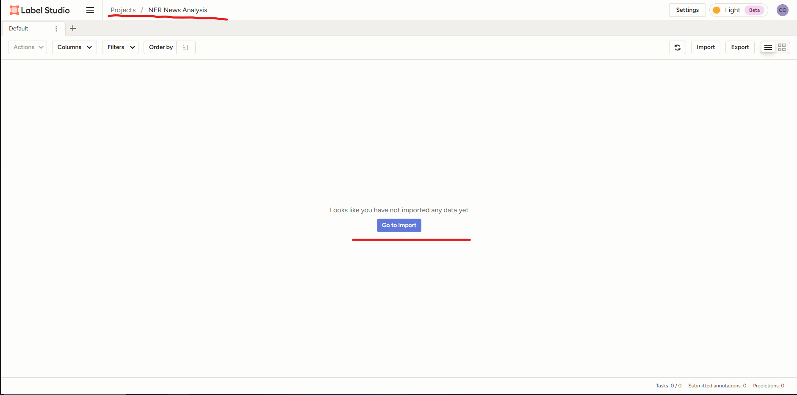

# Use Cases: Полный цикл разметки и обучения с Label Studio и CVAT

## Введение

Целью данного документа является демонстрация полных циклов работы с данными – от их сбора до обучения моделей машинного обучения – с использованием инструментов разметки Label Studio и CVAT. Эти сценарии (Use Cases) призваны наглядно показать практическое применение каждого инструмента в контексте MLOps-пайплайна и помочь в понимании всего процесса.

**Use Case 1: Извлечение именованных сущностей (NER) с помощью Label Studio**

### 1. Сбор и подготовка данных

*   **Описание типа данных:**
    Для данного Use Case мы будем использовать короткие текстовые фрагменты, представляющие собой новостные заголовки и краткие аннотации к новостям. Примерная длина каждого текстового фрагмента – от 1 до 3 предложений. Такой формат удобен для демонстрации процесса разметки NER, так как задачи (тексты) достаточно компактны.

*   **Источники:**
    Данные могут быть получены из различных источников:
    *   Публичные RSS-ленты новостных агентств (например, РИА Новости, Интерфакс).
    *   Парсинг заголовков с новостных веб-сайтов.
    *   Внутренние архивы новостных дайджестов компании.
    Гипотетически, мы могли бы использовать API новостного агрегатора или подготовить выгрузку из базы данных. Для нашего примера, предположим, что данные собраны в простой текстовый файл или CSV, где каждая строка – отдельная новость.

*   **Начальная подготовка:**
    Перед загрузкой в Label Studio может потребоваться минимальная подготовка:
    1.  **Очистка от HTML-тегов:** Если данные получены путем парсинга веб-страниц, необходимо удалить все HTML-теги, оставив только чистый текст.
    2.  **Удаление избыточных пробелов и спецсимволов:** Нормализация пробелов (удаление двойных пробелов, пробелов в начале/конце строки) и удаление нерелевантных спецсимволов (если они не являются частью сущностей).
    3.  **Разбиение на документы/задачи:** Убедиться, что каждый текстовый фрагмент, который будет представлять собой одну задачу для разметки, четко отделен (например, находится на новой строке в файле). Для длинных статей может потребоваться разбивка на абзацы или смысловые блоки. В нашем случае, так как мы работаем с короткими новостями, каждая новость уже является отдельной задачей.

*   **[Текст](data/news_data.txt)**


### 2. Настройка проекта в Label Studio
   Отлично! Переходим ко второму этапу.

---

**Use Case 1: Извлечение именованных сущностей (NER) с помощью Label Studio**

**(Предыдущий этап: 1. Сбор и подготовка данных)**

### 2. Настройка проекта в Label Studio

На этом этапе мы создадим проект в Label Studio, настроим интерфейс для разметки NER и импортируем наши подготовленные текстовые данные.

*   **Создание нового проекта:**
    1.  Войдите в Label Studio.
    2.  Нажмите кнопку "Create Project" (Создать проект).
        
    3.  Введите имя проекта, например, "NER News Analysis". Можно также добавить описание.
    4.  Нажмите "Save" (Сохранить) или "Create" (Создать).

*   **Конфигурация разметки (Labeling Config) для NER:**
    1.  После создания проекта перейдите на вкладку "Settings" (Настройки), а затем в подраздел "Labeling Interface" (Интерфейс разметки).
        
    2.  Здесь необходимо определить XML-конфигурацию для задачи NER. Можно выбрать один из готовых шаблонов ("Named Entity Recognition") и адаптировать его, или написать конфигурацию с нуля.
    3.  Для наших сущностей (`PERSON`, `ORG`, `LOC`, `PRODUCT`) конфигурация может выглядеть так:

        ```xml
        <View>
          <Labels name="label" toName="text">
            <Label value="PERSON" background="#FFD700"/> <!-- Золотой -->
            <Label value="ORG" background="#87CEFA"/>    <!-- Светло-голубой -->
            <Label value="LOC" background="#90EE90"/>    <!-- Светло-зеленый -->
            <Label value="PRODUCT" background="#FFA07A"/> <!-- Светло-лососевый -->
          </Labels>
        
          <Text name="text" value="$text"/> 
        </View>
        ```

        *   **Пояснение:**
            *   `<View>`: Корневой тег.
            *   `<Labels>`: Определяет набор меток (сущностей). `toName="text"` указывает, что эти метки применяются к элементу с `name="text"`.
            *   `<Label>`: Определяет каждую конкретную метку с ее значением (`value`) и цветом фона (`background`) для визуального выделения.
            *   `<Text>`: Определяет, как будут отображаться текстовые данные. `name="text"` — это идентификатор этого блока данных. `value="$text"` указывает, что данные для этого блока будут браться из поля `text` входных данных. **Если вы импортируете простой `.txt` файл (где каждая строка - задача), то можно использовать `value="$text"`. Если вы импортируете CSV файл, где текстовые данные находятся в столбце с именем, например, "text_data", то нужно будет написать `value="$text_data"`**.

    4.  Вставьте этот XML-код в поле "Labeling Config".
        
    5.  Нажмите "Save" (Сохранить).

*   **Импорт данных:**
    1.  Перейдите на главную страницу проекта (обычно кликнув на его имя) или найдите кнопку "Import" (Импорт) или "Add Data" (Добавить данные).
        
    2.  Выберите способ импорта. Для наших текстовых данных, если они сохранены в файле `news_data.txt` (каждая новость на новой строке) или `news_data.csv` (с одним столбцом `text`), выберите "Upload Files" (Загрузить файлы).
    3.  Загрузите ваш файл (`news_data.txt` или `news_data.csv`).
        `<!-- Скриншот: 07_LS_NER_окно_импорта_файла_выбор_файла.png -->`
        *(На скриншоте: диалоговое окно выбора файла для загрузки или интерфейс импорта, где файл уже выбран.)*
    4.  После загрузки Label Studio обработает файл и отобразит количество импортированных задач.
        `<!-- Скриншот: 08_LS_NER_сообщение_об_успешном_импорте_или_список_задач.png -->`
        *(На скриншоте: подтверждение успешного импорта, например, "5 tasks imported" или начальный вид списка задач в проекте.)*


### 3. Процесс разметки
   - Описание интерфейса разметки для NER
   - Ключевые действия разметчика (выделение текста, выбор метки)
     <!-- Скриншот: Интерфейс разметки текста в Label Studio с выделенной сущностью -->
   - Использование горячих клавиш (если применимо)
   - Контроль качества (например, review-режим, если используется)

### 4. Экспорт размеченных данных
   - Выбор формата экспорта (например, JSON, CONLL2003)
     <!-- Скриншот: Окно экспорта данных из Label Studio -->
   - Описание структуры экспортируемого файла

### 5. Преобразование данных (если необходимо)
   - Описание необходимости конвертации (если экспортированный формат не подходит напрямую)
   - Пример скрипта/инструмента для конвертации в формат, понятный для spaCy или Hugging Face Transformers
   <!-- Скриншот: (Опционально) Пример структуры данных после конвертации -->

### 6. Обучение модели
   - Тип модели: NER-модель (например, на основе spaCy, BERT/Hugging Face Transformers)
   - Концептуальное описание процесса обучения (подготовка данных, загрузка предобученной модели, дообучение, оценка)
   - Пример псевдокода или ссылки на туториалы

### 7. Итеративный процесс (Active Learning)
   - Краткое описание, как обученная модель может быть использована для предразметки новых данных в Label Studio через ML Backend.

## Use Case 2: Детекция объектов на изображениях с помощью CVAT

### 1. Сбор и подготовка данных
   - Описание типа данных (изображения)
   - Источники (примеры)
   - Начальная подготовка (если есть, например, изменение размера, аугментация на этапе подготовки датасета)
   <!-- Скриншот: Пример исходных изображений -->

### 2. Настройка проекта/задачи в CVAT
   - Создание нового проекта и задачи
     <!-- Скриншот: Окно создания задачи в CVAT -->
   - Определение меток (labels) для объектов (car, pedestrian, traffic_light)
     <!-- Скриншот: Интерфейс определения меток в CVAT -->
   - Импорт данных (загрузка изображений)
     <!-- Скриншот: Окно загрузки изображений в CVAT -->

### 3. Процесс разметки
   - Описание интерфейса разметки для детекции объектов (Bounding Boxes)
   - Ключевые действия разметчика (рисование BBox, выбор метки)
     <!-- Скриншот: Интерфейс разметки BBox в CVAT -->
   - Использование инструментов (зум, панорамирование, горячие клавиши)
   - Использование AI-помощников (если есть, например, автодетекция или интерактивная сегментация для помощи в BBox)
     <!-- Скриншот: (Опционально) Пример использования AI-инструмента в CVAT -->

### 4. Экспорт размеченных данных
   - Выбор формата экспорта (например, COCO JSON, Pascal VOC, YOLO)
     <!-- Скриншот: Окно экспорта аннотаций из CVAT -->
   - Описание структуры экспортируемого файла

### 5. Преобразование данных (если необходимо)
   - Описание необходимости конвертации (например, если модель ожидает специфичный формат YOLO, а экспорт был в COCO)
   - Пример скрипта/инструмента для конвертации
   <!-- Скриншот: (Опционально) Пример структуры данных после конвертации -->

### 6. Обучение модели
   - Тип модели: Детектор объектов (например, YOLOv5, Faster R-CNN на PyTorch/TensorFlow)
   - Концептуальное описание процесса обучения (подготовка датасета, конфигурация модели, обучение, оценка)
   - Пример псевдокода или ссылки на репозитории моделей

### 7. Итеративный процесс (Active Learning)
   - Краткое описание, как обученная модель детекции может быть использована для автоматической аннотации новых данных в CVAT.